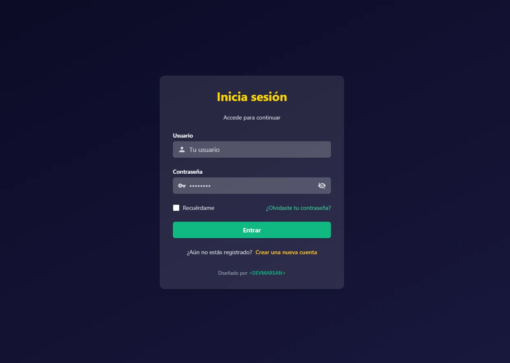

# Login Page – DEVMARSAN

Este proyecto es un **login modular y estilizado** desarrollado con **Astro** y **TailwindCSS**, pensado como parte del portafolio de **<DEVMARSAN>** y para mostrar buenas prácticas de UI/UX, branding y accesibilidad.

## ✨ Características

- Campo de **usuario** con ícono de perfil (`mdi:account`).
- Campo de **contraseña** con ícono de llave (`mdi:key`) y toggle de visibilidad (ojo abierto/cerrado).
- Opción **"Recuérdame"** con checkbox estilizado.
- Link de **recuperación de contraseña**.
- Link de **registro**: “¿Aún no estás registrado? Crear una nueva cuenta”.
- Footer con branding: **Diseñado por <DEVMARSAN>** enlazado a [https://daviddevmx.com](https://daviddevmx.com).

## 🛠️ Tecnologías utilizadas

- [Astro](https://astro.build/) – Framework moderno para sitios rápidos y modulares.
- [TailwindCSS](https://tailwindcss.com/) – Estilos utilitarios para diseño responsivo y consistente.
- [Material Design Icons](https://pictogrammers.github.io/@mdi/font/) – Iconografía profesional.
- [astro-icon](https://github.com/natemoo-re/astro-icon) – Integración de iconos en Astro.

## 🚀 Instalación y uso

1. Clona el repositorio:
   git clone https://github.com/dmarsan21/login-page.git
   cd tu-repo

2. Instala dependencias, ejecuta en modo desarrollo y abre en tu navegador:
npm install
npm run dev
http://localhost:4321

3. Estructura del proyecto:
src/
 └── components/
      ├── LoginForm.astro
      └── FormInput.astro

## 📜 Licencia

Este proyecto **no tiene licencia**.  
El código está protegido por derechos de autor y su uso está restringido.  
Para más información o permisos, contacta directamente a [DEVMARSAN](https://daviddevmx.com).

## 📸 Vista previa

